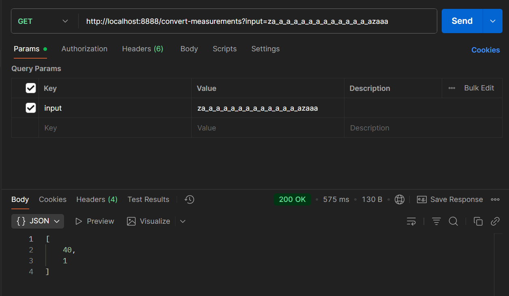

# Alphabet Alchemist API

The **Alphabet Alchemist API** is a Python web service built with **FastAPI** that converts encoded measurement strings into numeric inflows.  
It also saves the history of all conversions in a SQLite database and provides logging for observability.  

This project is containerized using **Docker** and **Docker Compose** for easy deployment, but it can also run locally with Python.

---

## 📖 Conversion Logic

The core logic is implemented in [`Alphabet_Alchemist_func.py`](./Alphabet_Alchemist_func.py).  

### Rules:
1. Each input string represents **packages of measurements**.
2. Characters map to numbers:
   - `"a"` = 1, `"b"` = 2, … `"z"` = 26
3. `"z"` has a special rule:
   - It cannot stand alone.
   - Consecutive `"z"` characters are added together (`"zz"` = 52).
   - The next non-`"z"` character is also added.  
     Example: `"za"` → 26 + 1 = 27
4. An underscore (`"_"`) represents **0** .
5. Each package begins with a **count value** (how many numbers to read).  
   The following characters are summed according to the count.  
   - Example: `"abbcc"`
     - `a = 1` → take next 1 element (`b = 2`) → total = 4 → `[2]`
     - `b = 2` → take next 2 elements (`cc=3+3=6`) → total = 6 → `[2,6]`

### Examples:
| Input                         | Output        |
|-------------------------------|---------------|
| `aa`                          | `[1]`         |
| `abbcc`                       | `[2, 6]`      |
| `dz_a_aazzaaa`                | `[28, 53, 1]` |
| `a_`                          | `[0]`         |
| `abcdabcdab_`                 | `[2, 7, 7, 0]` |
| `za_a_a_a_a_a_a_a_a_a_a_azaaa`| `[40, 1]`     |

---

## 📂 Project Structure

### alphabet-alchemist/
- `main_app.py` → FastAPI entrypoint (routes, logging, app startup)
- `Alphabet_Alchemist_func.py` → Conversion logic (string → numeric inflows)
- `db.py` → SQLite database functions (init, insert, fetch)
- `Dockerfile` → Docker image build instructions
- `docker-compose.yaml` → Container orchestration
- `logs/` → Application logs (mounted to host)
- `history.db` → SQLite database file
- `requirements.txt` → Python dependencies
- `CHANGELOG.md` → Version history of changes
- `version.txt` → Current version (e.g. 0.0.5)
- `README.md` → Documentation


---

## 📋 Prerequisites

### To Run Locally:
- Python 3.11+
- pip (Python package manager)

### To Run with Docker:
- [Docker](https://docs.docker.com/get-docker/)  
- [Docker Compose](https://docs.docker.com/compose/install/)  

---

## ⚙️ Setup Instructions

###  Local Setup (Without Docker)

1. Clone the repository: [git repo](https://github.com/Muzna-Adil-Almamari/The-Alphabet-Alchemist)
   ```bash
   git clone https://github.com/Muzna-Adil-Almamari/The-Alphabet-Alchemist


2. Create a virtual environment & install dependencies:
    ```bash
    python -m venv venv
    source venv/bin/activate      # Linux/Mac
    venv\Scripts\activate         # Windows

    pip install -r requirements.txt

3. Run the API server:
    ```bash
    uvicorn main_app:app --reload --port 8888
4. Access the API at:
    ```bash
    http://localhost:8888
### Run with Docker Compose (Recommended)    

1. Build and start the containers:
    ```bash
    docker-compose up --build -d
2. Stop the containers:
    ```bash
    docker-compose up --build -d
3. View logs:
    ```bash
    docker logs alphabet_alchemist_app

### By default, the API will run on port `8888`.
---
## Run from Docker Hub (No Build Needed)
You can directly pull and run the pre-built image from Docker Hub:

`docker pull muzna11/alphabet_alchemist:latest`

`docker run -d -p 8888:8888 --name alphabet_alchemist_app muzna11/alphabet_alchemist:latest`

Now the API is available at:
```
http://localhost:8888
```
---
## 🔌 API Endpoints
1. Convert Measurements
    - GET `/convert-measurements?input=<string>`
     - Example:
        ```bash
        http://localhost:8888/convert-measurements?input=abbcc
    - Output: 
        [2, 6]
2. Fetch History
    - GET `/history`
    - Example:
        ```bash
        http://localhost:8888/history
    - Output: 
        ```json
        [
            {
                "id": 1,
                "input": "abbcc",
                "output": "[2, 6]"
            }
        ]
---
## 🔄 Updating the Application
If you change code or dependencies, rebuild and restart:
```bash
 docker-compose up --build -d
 ```


---
## ⚙️ Running on a Custom Port
can specify a custom port in `docker-compose.yaml`:
```yaml
ports:
  - "9000:8888"
```
Then access the API at:
```bash
http://localhost:9000
```

---
##  Changelog & Versioning

- All version updates are tracked in `CHANGELOG.md`.

- The current version is stored in `version.txt`.

---
## System Architecture

---



